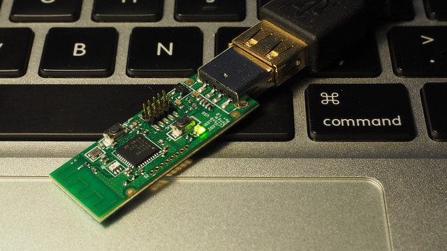

# Bluetooth LE sniffer

A Bluetooth LE sniffer for CC2540 USB dongle and macOS.



This application captures Bluetooth LE packet in air and saves them to a file.

## Usage

This is a command line utility.

```
$ Blesniffer [-c channel#] [-d device#] [-v] output.pcap
```

### Parameters

  * `-c channel#`: RF channel. The channel must be from 0 to 39. One of 37, 38 or 39 is recommended. This is option parameter. The default channel is 37.
  * `-d device#`: An index of device in list. This is option parameter. Th default index is 0.
  * `-v`: Enter verbose mode. This is option parameter. The default is no-verbose mode.
  * `output.pcap`: A name of output file which format is PCAP. If you specified '-', the program outputs captured packets to standard out.

The content of `output.pcap` can be seen per packet using [Wireshark](https://www.wireshark.org/).

## Requirements

* Texas Instruments [CC2540EMK-USB](http://www.ti.com/tool/cc2540emk-usb)
* macOS 10.12
* Xcode 8.1

## License

Please read [this file](LICENSE).

